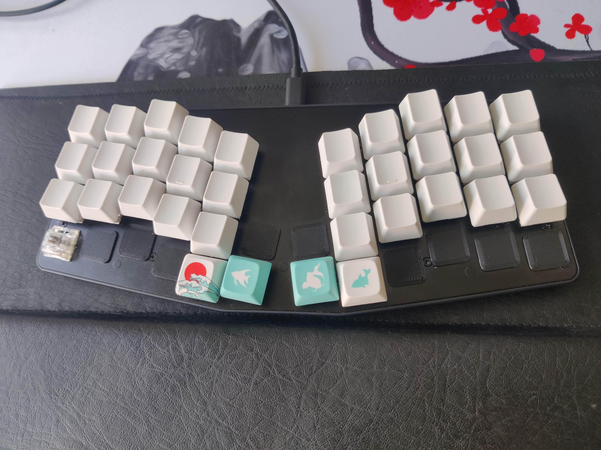
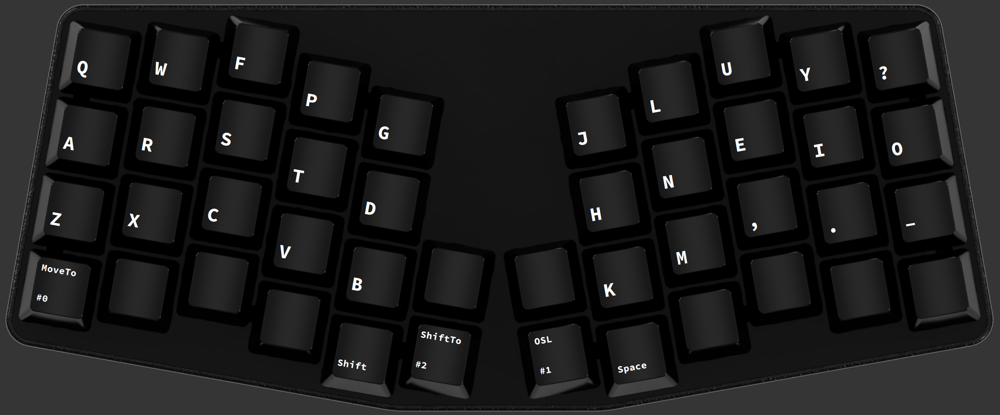
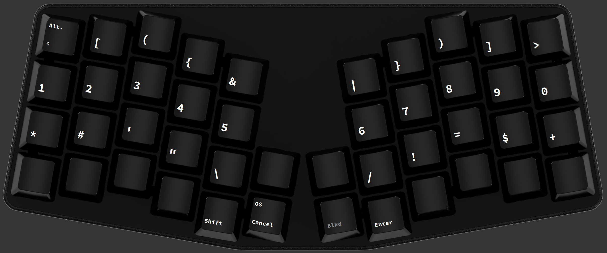
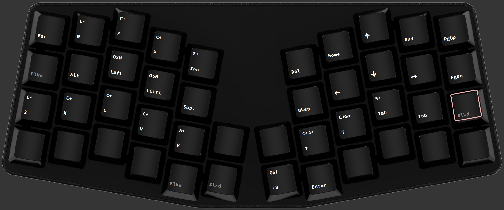
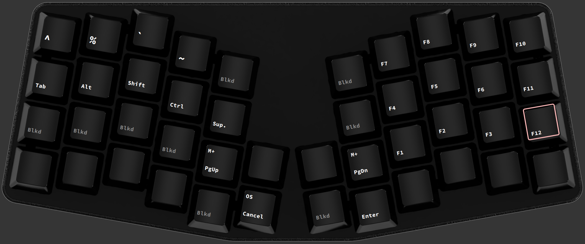
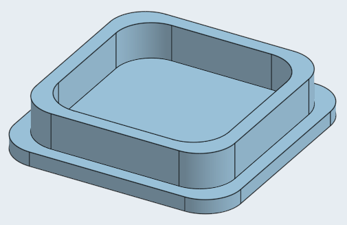

# MONE-layout - a 34 key layout targeted at programmers with some tweaks for the german language

This repository contains my current layout that I created for my Keyboardio atreus. As always when I start something I can't stop until I found the (for me) perfect solution.

The atreus is a tiny keyboard already but I wanted to go even smaller and less keys.

I had problems with more than one thumb button. More than once I forgot which button was for which layer. So I removed every key (physically see image) in the bottom row except the four innermost thumb buttons. Now I only had 34 keys left but need to be able to do everything with it.

Please note that I'm using a german layout in my linux so the relevant shift states on the base layer are: .: ,; -_

Here is my take on the layout:

## Base layer

## Numbers and Symbols

## Movement (Heavily inspired by Dreymars Extend layer)

## Functions and more seldom used symbols

## Firmware changes
I implemented some minor things within kaleidoscope (the firmware of the atreus).

These are:

- Pressing shift + space works as backspace

- Longpressing the position of a prints a german ä (used the same trick for ßüö€@)

- As the Qukey plugin that I used for these longpresses adds a delay to letters being printed I moved them to layer 1 which is at the same time my numbers and symbols layer.

- I disabled the stickability of one shots as I constantly got stuck and didn't have a key to cancel. And I only use the one shot on the base layer for moving to my symbols layer, as oftentimes I only need one symbol at a time. And I use it on my movement layer to get shift, ctrl for shortcuts like ctrl+s.

- I only implemented these tweaks and defined the remaining keymap within Chrysalis to have a visual editor. (see mone-layout-chrysalis.json)

## 3D printed blank caps
As I physically removed the switches and buttons I didn't want to let the wholes open.
For this I designed some caps.

You can find the project [here](https://cad.onshape.com/documents/f6271235c8a2c9363f22b248/w/8a7568e65462614faf204002/e/96d7997ea057a755a6f7dc4d?renderMode=0&uiState=630336ca176e14202d76d4c8)
I added the exported stl and added it to this repo (atreus_blank_caps.stl)

## Ideas on how I'll try to improve this layout

- Change the shift state of the braces and brackets so that [] {} () <> require only one button each. This will free up 4 keys and would enable me to move the 4 symbols that are currently on my function layer